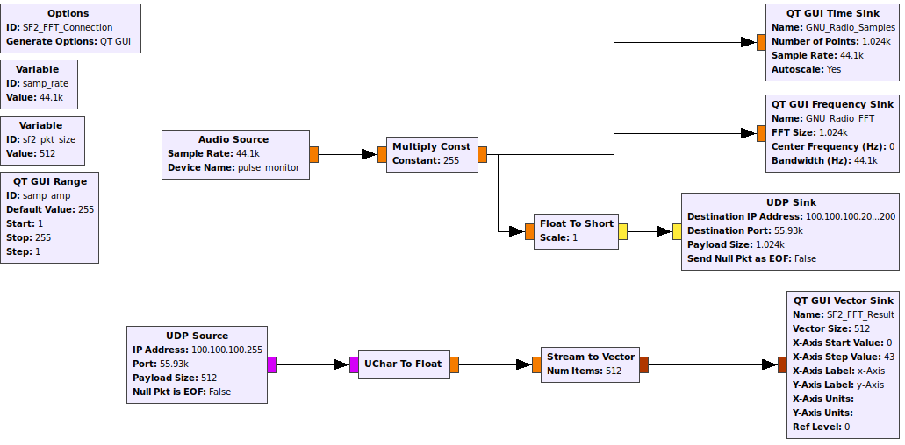
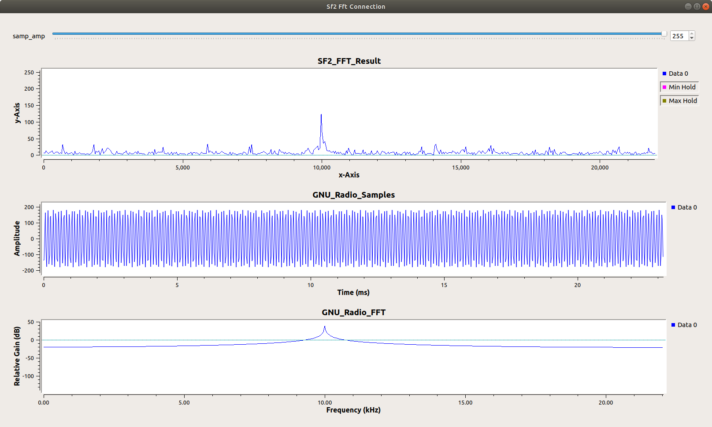

# GNU_Radio Interaction

This GNU Radio instance is being run in a virtualbox VM on a guest Ubuntu 18.04.4 (plus whatever updates downloaded automatically once running).

The audio source is a solid tone of 10kHz generated and played using Audacity. This audio is then [virtually looped back to the audio input](https://wiki.gnuradio.org/index.php/ALSAPulseAudio#Monitoring_the_output_of_your_system) where it is captured by the Audio Source block in the GNU Radio flow. This data/audio path was necessary to create a real time sampling rate to later properly load samples into the Smartfusion2 Maker Kit. Without including the audio interfaces in the data path, GNU Radio would produce samples as quickly as it could and shove them into the ethernet adapter until the output buffer was full.

The VM has a bridged network connection to the USB-Ethernet adapter I'm using. This results in a LAN where my desktop has a static IP of 100.100.100.100, the VM has a static IP of 100.100.100.101, and the SF2 kit has a static IP of 100.100.100.200. In order to accomodate this network setup the SF2 device responds to the ARP protocal so both my desktop and VM can send packets to the SF2 device without bothering each other. The SF2 at the moment returns data as a broadcast (100.100.100.255) so that result packets can be analyzed by tools on both the VM and my desktop.

