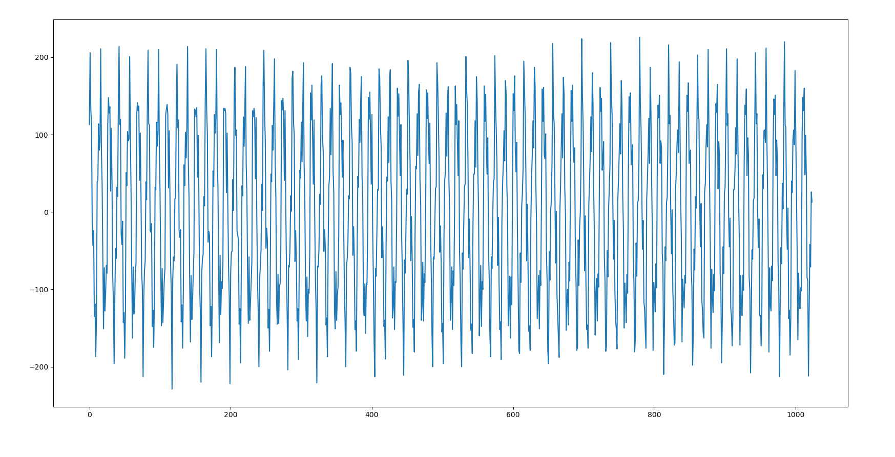
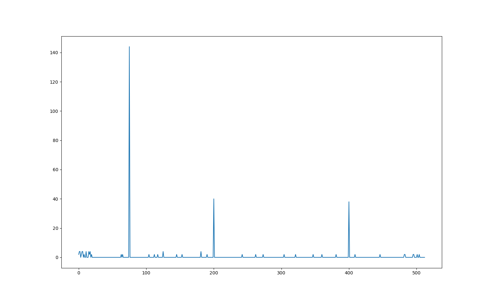
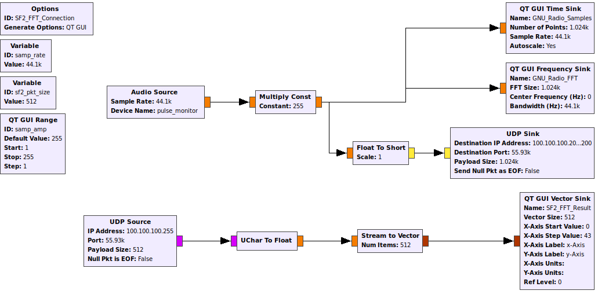
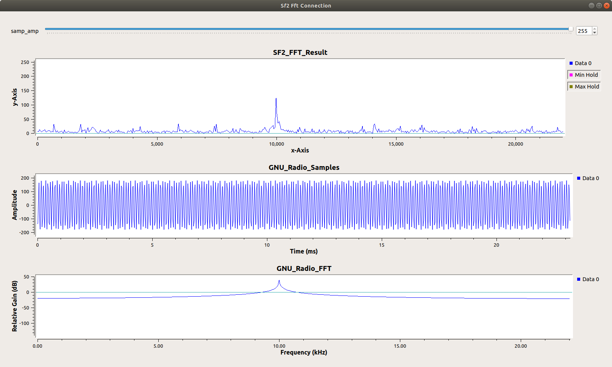

# SF2_Eth_FFT
Ethernet Attached FPGA FFT

Radix-2 FPGA FFT controlled by the ARM Core. Data is sent and received over Ethernet based on commands sent over Ethernet.


## Python tests

Initial tests involved creating a byte array from 1024 sin wave samples. For fun, multiple sin waves were added together to create a signal with a high amplitude and multiple lower amplitude signals.



Python code excerpt to generate signals and clamp the values to 9 bits signed:

```python
N_exp = 10
data_width = 9
sin_samples = []
data_cnt = 2**(N_exp)


sample2_amp = .5
smpl2_per = 200
sample3_amp = .5
smpl3_per = 400
noise_multi = .3
noise = np.random.normal(0, noise_multi/3, data_cnt)
carrier_amp = 3
carrier_per = 75


for i in range(0, data_cnt):
    sample2 = sample2_amp*math.sin(2*math.pi*smpl2_per*(i/data_cnt))
    sample3 = sample3_amp*math.sin(2*math.pi*smpl3_per*(i/data_cnt))
    sample1 = (carrier_amp - sample2_amp - sample3_amp - noise_multi)*math.sin(1+2*math.pi*carrier_per*i/data_cnt)

    signal_val = (sample1+sample2+sample3+noise[i])/carrier_amp
    signal_val = int(round(signal_val * (2 ** (data_width - 1) - 1)))                                      # signed
    sin_samples.append(signal_val)
```

These samples were sent to the Smartfusion2 Maker Kit over Ethernet using UDP protocol. The SF2 device calculates the FFT of the samples, and returns it over Ethernet using UDP protocol.




Some noise can be seen which is likely the result of rounding errors within the FFT exhagerated by the imprecise Alpha Max plus Beta Min algorithm.

I'm perfectly happy with these results.

## GNU Radio Tests

The Python tests proved the FFT produced good results, but I wanted to be able to stream in data to be processed. In lieu of writing a multithreaded Python script from the ground up I found GNU Radio which seems to offer all the functionality I need.

The GNU Radio Flow:



More details about the flow are in [the GNU_Radio folder README](https://github.com/PKazm/SF2_Eth_FFT/tree/master/GNU_Radio).

The key parts are that GNU Radio is sampleing a 10kHz audio tone at 44.1Khz sample rate, transmitting it to the SF2 device via UDP, and receiving the FFT results back over UDP. The FFT results are displayed in the SF2_FFT_Result plot. GNU Radio is also displaying the Sample stream and the built in FFT plot for reference.

The results:



As can be seen the results are somewhat noisy, but the peak at 10kHz is right where it should be. It should be noted that the SF2 FFT has no windowing or averaging anywhere in the data path. There is also an uncertainty in the UDP packes GNU Radio is sending. For this test the SF2 device is pretty dumb and assumes all data packets being received are 512 samples and 2 consecutive packets on port 0xDA7A represent a continuous set of data. I do not know of a way to ensure these requirements are met by the GNU Radio UDP Sink block. Wireshark suggests they aren't all the time but I haven't dived too deeply into it.

A sanity check is possible by also running my Python UDP receiver (server?) while the GNU Radio flow is executing. SF2 result packets are broadcast to all on the network so both tools can receive and analyze or display the data. The results looked good and closely match the results obtained in GNU Radio.

## Thoughts

Is this hardware implemented FFT faster than performing the FFT on my desktop in GNU Radio,Gnu Octave, or even Python? Maybe? But almost certainly not. First run results of running a 1024 size FFT in GNU Octave take about twice as long as sending the data over ethernet to the SF2 device and receiving the results. Subsequent runs of the GNU Octave FFT are signficantly faster, most likely due to the necessary program code already being in CPU cache or RAM.

The major bottleneck is moving the data into and out of the device. For example almost 2/5 of the roundtrip time is spent reading the samples from the ethernet MAC into the FFT SRAM. The roundtrip time is also affected by the link speed of the ethernet connection, something like 30% less time when operating at 1gbps instead of 100mbps.

I have no hard numbers for any of these performance comparisons, only annecdotes from quick tests in the middle of getting this whole chain of connections working.

A way around these bottlenecks is to implement a GMII "sniffer" to intercept packets identified as data and feed them directly into the FFT. This would bypass the ARM core entirely and would be about as fast as things could get I think. Including a GMII transmitter would speed up the other end of the chain but would certainly be more complicated as now the ARM core must be informed of when it does or does not have control of the GMII transmit signals.

At the end of everything though, its pretty neat.
